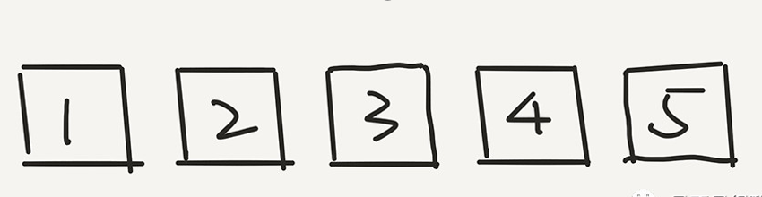
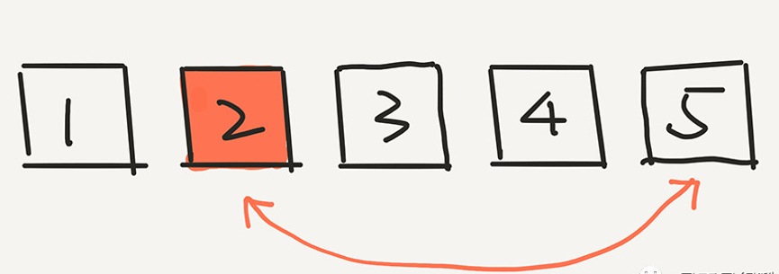
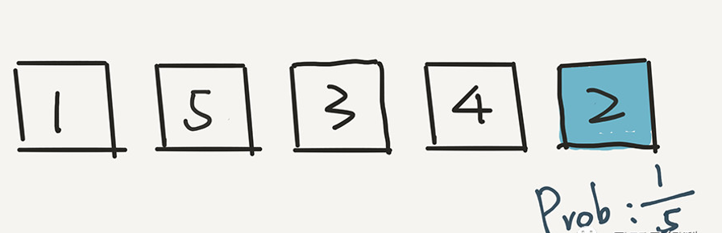
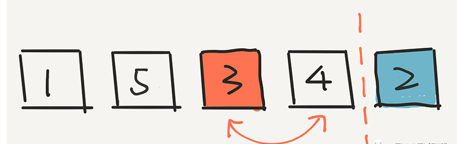
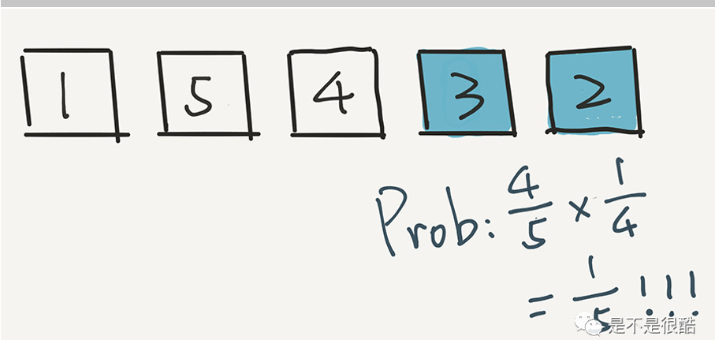
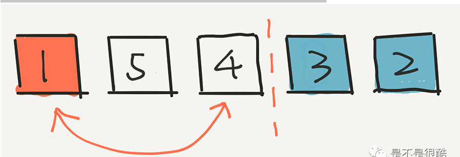
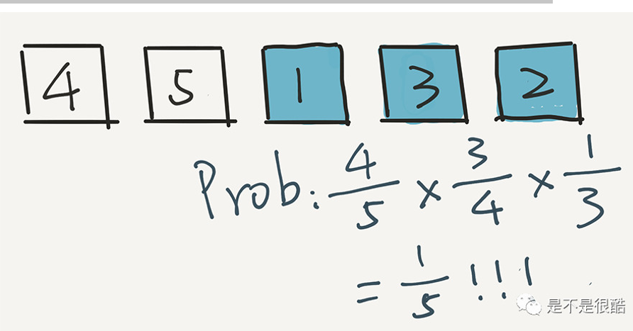
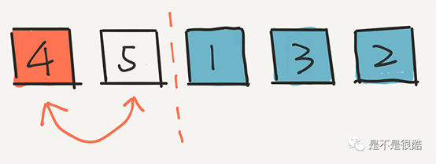
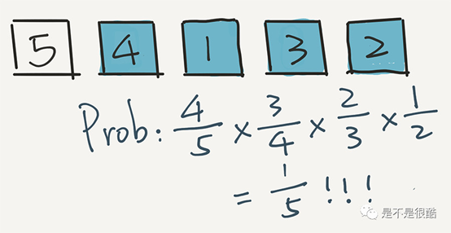
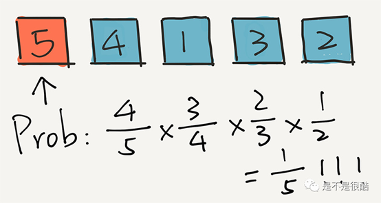

# 洗牌算法(Shuffle Algorithm)
[toc]
---
##  1.什么是洗牌算法

 Knuth算法,又称洗牌算法或者费歇尔算法。洗牌(随机)算法有很多应用，例如我们平时用的音乐播放器随机播放，棋牌游戏中的洗牌，扫雷游戏中雷的位置随机等等，都会用到洗牌算法。
 洗牌的结果是所有元素的一个排列。一副牌如果有 n 个元素，最终排列的可能性一共有 n! 个。公平的洗牌算法，应该能等概率地给出这 n! 个结果中的任意一个。

 如思考到这一点，我们就能设计出一个简单的暴力算法了：对于 n 个元素，生成所有的 n! 个排列，然后，随机抽一个。

 这个算法绝对是公平的。但问题是，复杂度太高。复杂度是多少呢？O(n!)。因为，n 个元素一共有 n! 种排列，我们求出所有 n! 种排列，至少需要 n! 的时间。

 我们再换一个角度思考“公平”这个话题。其实，我们也可以认为，公平是指，**对于生成的排列，每一个元素都能等概率地出现在每一个位置。**或者反过来，**每一个位置都能等概率地放置每个元素。

 i 从后向前，每次随机一个 [0...i] 之间的下标，然后将 arr[i] 和这个随机的下标元素，也就是 arr[rand() % (i + 1)] 交换位置

 由于每次是随机一个 [0...i] 之间的下标，所以，我们的计算方式是 rand() % (i + 1)，要对 i + 1 取余，保证随机的索引在 [0...i] 之间

## 2.算法实现

```javascript
function shuffle(source) {
  const arr = source.slice()
  for (let i = 0; i < arr.length; i++) {
    const j = getRandomInt(i)
    swap(arr, i, j)
  }
  return arr
}

function getRandomInt(max) {
  return Math.floor(Math.random() * (max + 1))
}

function swap(arr, i, j) {
  const t = arr[i]
  arr[i] = arr[j]
  arr[j] = t
}

const array= [1,2,3,4,5]
shuffle(array)
```


## 3.实现步骤模拟

我们简单的只是用 5 个数字进行模拟。假设初始的时候，是按照 1，2，3，4，5 进行排列的。



那么，根据这个算法，首先会在这五个元素中选一个元素，和最后一个元素 5 交换位置。假设随机出了 2



下面，我们计算 2 出现在最后一个位置的概率是多少？非常简单，因为是从 5 个元素中选的嘛，就是 1/5。实际上，根据这一步，任意一个元素出现在最后一个位置的概率，都是 1/5。



下面，根据这个算法，我们就已经不用管 2 了，而是在前面 4 个元素中，随机一个元素，放在倒数第二的位置。假设我们随机的是 3。3 和现在倒数第二个位置的元素 4 交换位置。



下面的计算非常重要。3 出现在这个位置的概率是多少？计算方式是这样的：



其实很简单，因为 3 逃出了第一轮的筛选，概率是 4/5，但是 3 没有逃过这一轮的选择。在这一轮，一共有4个元素，所以 3 被选中的概率是 1/4。因此，最终，3 出现在这个倒数第二的位置，概率是 4/5 * 1/4 = 1/5。还是 1/5 !

实际上，用这个方法计算，任意一个元素出现在这个倒数第二位置的概率，都是 1/5。

相信聪明的同学已经了解了。我们再进行下一步，在剩下的三个元素中随机一个元素，放在中间的位置。假设我们随机的是 1。



关键是：1 出现在这个位置的概率是多少？计算方式是这样的：



即 1 首先在第一轮没被选中，概率是 4/5，在第二轮又没被选中，概率是 3/4 ，但是在第三轮被选中了，概率是 1/3。乘在一起，4/5 * 3/4 * 1/3 = 1/5。用这个方法计算，任意一个元素出现在中间位置的概率，都是 1/5。这个过程继续，现在，我们只剩下两个元素了，在剩下的两个元素中，随机选一个，比如是4。将4放到第二个位置。



然后，4 出现在这个位置的概率是多少？4 首先在第一轮没被选中，概率是 4/5；在第二轮又没被选中，概率是 3/4；第三轮还没选中，概率是 2/3，但是在第四轮被选中了，概率是 1/2。乘在一起，4/5 * 3/4 * 2/3 * 1/2 = 1/5。用这个方法计算，任意一个元素出现在第二个位置的概率，都是 1/5。



最后，就剩下元素5了。它只能在第一个位置呆着了。

那么 5 留在第一个位置的概率是多少？即在前 4 轮，5 都没有选中的概率是多少？在第一轮没被选中，概率是 4/5；在第二轮又没被选中，概率是 3/4；第三轮还没选中，概率是 2/3，在第四轮依然没有被选中，概率是 1/2。乘在一起，4/5 * 3/4 * 2/3 * 1/2 = 1/5。



在整个过程中，每一个元素出现在每一个位置的概率，都是 1/5 ！

所以，这个算法是公平的。

