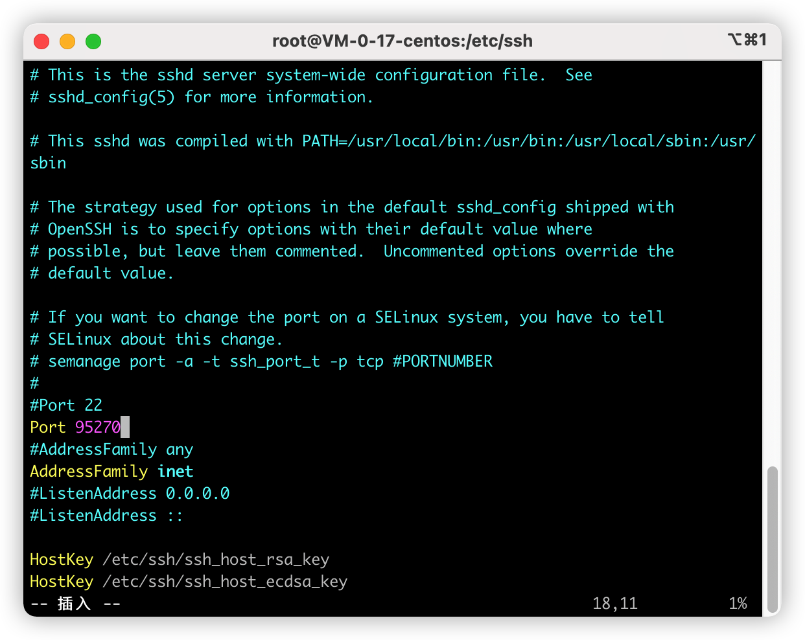

ssh命令
[toc]
---
## ssh连接远程服务器
linux服务器一般默认的ssh端口号都为22，如果不是22端口则通过-p参数指定。
连接方式：ssh 用户名@服务器ip地址 -p 端口号。

```Shell
//连接远程服务器
ssh root@192.168.1.100 -p 27617
//登出服务器
logout
```

## 如何查看ssh端口
```Shell
netstat -anp|grep ssh
```
注意：如果netstat命令未找到，则通过yum install net-tools 命令安装网络工具。

## 如何修改默认22端口

* 1、打开/etc/ssh/sshd_config文件


* 2、按i，进入编辑模式，修改Port端口，修改完端口后按esc退出编辑模式。



* 3、按“:wq” 保存文件并退出
* 4、查看修改结果


* 5、重启ssh服务
```shell
systemctl restart sshd.service
```


## 修改ssh链接断开时间

> https://blog.csdn.net/abld99/article/details/69388858

vi /root/.ssh/config

ServerAliveInterval 60