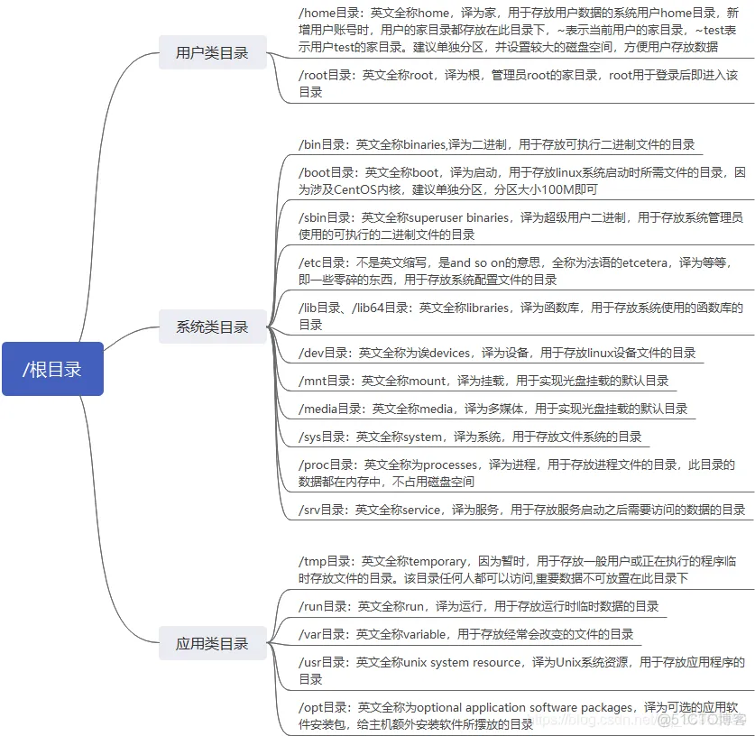

# Linux常用命令
## Centos目录结构
> https://blog.51cto.com/u_15287666/3049601



## 1.系统相关命令

- 显示当前目录的路径
```Shell
# Print Working Directory的缩写(#为shell语音的注释标志符)
pwd
```
- 查看系统版本信息
```
uname -a
```

## 2.文件操作相关命令
#### ls命令
>列出当前目录下的所有文件、文件夹,常用参数：
>-a 显示所有文件及目录 (ls内定将文件名或目录名称开头为"."的视为隐藏档，不会列出)
>-l 除文件名称外，亦将文件型态、权限、拥有者、文件大小等资讯详细列出
>-r 将文件以相反次序显示(原定依英文字母次序)
>-t 将文件依建立时间之先后次序列出
>-A 同 -a ，但不列出 “.” (目前目录) 及 “…” (父目录)
>-F 在列出的文件名称后加一符号；例如可执行档则加 “*”, 目录则加 “/”
>-R 若目录下有文件，则以下之文件亦
```
ls
```

#### cd命令 
cd命令用于切换当前工作目录到指定路径
```
#定位到根目录
cd /

#定位到home目录
cd ~

#定位到当前目录的上一层
cd ../

#定位到 usr目录下的share目录
cd /usr/share
```

#### mkdir命令
mkdir命令用于新建子目录
```
#新建一个test的目录
mkdir test
```

#### scp命令
scp是 secure copy的缩写, scp是linux系统下基于ssh登陆进行安全的远程文件拷贝命令。
scp [可选参数] file_source file_target 
>常用参数：
>-q： 不显示传输进度条。
>-r： 递归复制整个目录。
>-v：详细方式显示输出。scp和ssh(1)会显示出整个过程的调试信息。这些信息用于调试连接，验证和配置问题
```
#从本地拷贝文件到服务器
#注意:  1、“/”而不是“\”; 2、文件路径是区分大小写的
 scp F:/CloudMusic/追光者.mp3 root@192.168.1.100:/test/

#拷贝本地  文件夹  到服务器
scp -r F:/CloudMusic/ root@192.168.1.100:/test/

#从服务器拷贝文件到本地
scp root@192.168.1.100:/test/追光者.mp3 f:/
```

#### tar命令（压缩/解压）
系统中解压与压缩程序非常多，常用的包括了 tar、gzip、gunzip、bzip2、bunzip2、 zip、 unzip等指令

>将所有.jpg的文件打成一个名为all.tar的包。
>-c是表示产生新的包 ，-f指定包的文件名。
>tar -cf all.tar *.jpg

>将所有.gif的文件 增加 到all.tar的包里面去。
>-r是表示增加文件的意思
>tar -rf all.tar *.gif

>更新原来tar包all.tar中logo.gif文件，
>-u是表示更新文件的意思。
>tar -uf all.tar logo.gif

>列出all.tar包中所有文件，
>-t是列出文件的意思
>tar -tf all.tar

>解出all.tar包中所有文件，
>-x是解开的意思
>tar -xf all.tar

## 3.网络相关命令
#### 查看ip地址
```shell
ip addr
```

## 4.防火墙

1. 查看防火墙状态

```shell
systemctl status firewalld.service
```

2. 开启防火墙

```shell
systemctl start firewalld.service
```
3. 关闭防火墙

```shell
systemctl stop firewalld.service
```
4. 禁用防火墙

```shell
systemctl disable firewalld.service
```
## 5.查看服务进程及端口
```shell
# 查看nginx服务进程
ps -ef | grep nginx 

#查看端口使用
#lsof(list open files)是一个列出当前系统打开文件的工具。
lsof -i:端口号
```
## 6.切换用户
切换用户（swith user）
```shell
su root
```
## 7.wget下载文件
```

//后台下载文件
wget -b http://www.baidu.com/1.zip
//查看文件下载进度，方法1
tail -f wget-log
//查看文件下载进度，方法2
cat wget-log
```