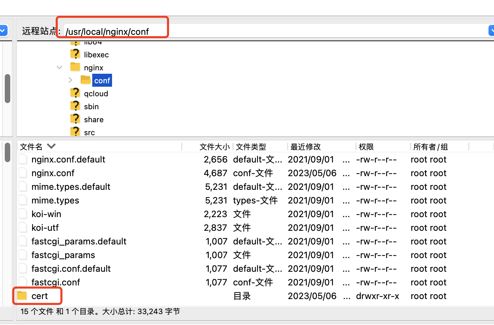
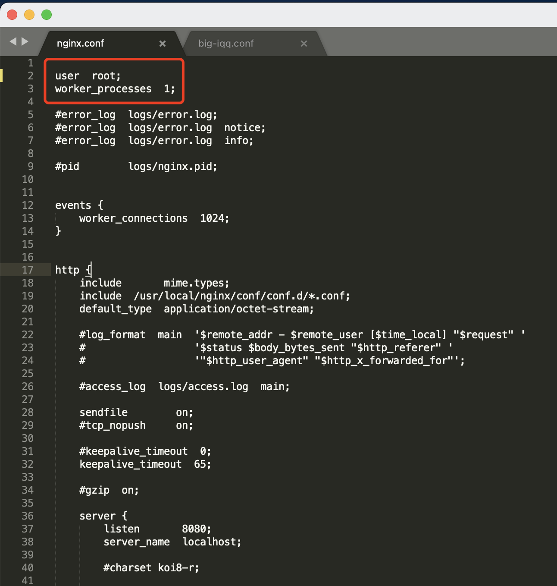

# Nginx配置

[toc]
---

## 源码方法安装及开机自启
安装依赖库

sudo apt install build-essential zlib1g-dev libpcre3-dev libssl-dev

https://bbs.huaweicloud.com/blogs/detail/292610

https://www.jianshu.com/p/10f67d549194

## HTTPS配置

https://help.aliyun.com/video_list/54214.html?spm=a2c4g.11174359.6.578.473d6998ayQaf6

https://cloud.tencent.com/document/product/400/35244

nginx安装https模块

https://blog.csdn.net/weixin_41709748/article/details/127604499




## 查看开发端口
CentOS 7查看以开放端口命令：
firewall-cmd —list-ports

查看端口是否开放命令：
第一个方法就是使用lsof -i:端口号命令行，例如lsof -i:80。如果没有任何信息输出，则表示该端口号(此处是80)没有开放。
第二个方法就是使用netstat -aptn命令行，查看所有开启的端口号。
第四种方法就是使用netstat -nupl是查看系统中所有使用udp协议的端口号。
第五种方法就是使用netstat -ntpl是查看系统中使用tcp协议的端口号信息。

开放centos7防火墙的端口：

添加开放端口号
firewall-cmd —permanent —zone=public —add-port=8080/tcp

重启firewall
firewall-cmd —reload

## 查找安装目录
```shell
--方法1
ps -ef | grep nginx
--方法2
find /|grep nginx.conf
```

## 查看Nginx配置文件路径
nginx -t 可获取默认配置文件地址;

nginx -T 查看详细配置信息;

## 配置所有请求允许跨域
```shell
http {
    #允许所有请求跨域，如果要允许单个方法跨域，则在location中配置。
    add_header Access-Control-Allow-Origin *;
    add_header Access-Control-Allow-Headers X-Requested-With;
    add_header Access-Control-Allow-Methods GET,POST,OPTIONS;
}
```

## 配置反向代理
```shell
http{
    location {
        #配置单个请求允许跨域
        add_header Access-Control-Allow-Origin *;
        add_header Access-Control-Allow-Headers X-Requested-With;
        add_header Access-Control-Allow-Methods GET,POST,OPTIONS;
        #反向代理
        proxy_pass http://www.baidu.com/mdj/query.do;
    }
}
```

## 配置虚拟目录
```shell
#配置虚拟目录
location /subway/ {
    alias C:/subway/dist/;
    index index.html;
}
```

## 部署多个静态资源目录
https://blog.csdn.net/qq_27346503/article/details/108923203

## 引入conf配置文件及修改root目录

- 在nginx.conf配置文件中的http模块中添加引入配置文件
```shell
include  /usr/local/nginx/conf/conf.d/*.conf;
```

- 在conf.d目录新建配置文件，文件名可以任意取名，如a.conf,文件内容为
```shell
  server{   
      listen 6080;
      server_name localhost;
  
  
      location / {
          root   /root/project/big-iqq/dist;
          index  index.html index.htm;
      }
  }
```
注意 root 配置对应目录下的文件夹权限，如果出现 403错误则修改权限
修改文件权限: chmod -R 777 /root/project/big-iqq/dist

## 查看nginx的启动用户
```shell
ps aux | grep "nginx: worker process”
//输出类似用户
//nobody
//root
```
修改nginx配置文件 讲启动用户改为root

  

## 日志分割文件

> https://jingsam.github.io/2019/01/15/nginx-access-log.html

方式一：

此方法有两个问题：一是如果`if`条件不成立，那么`$year`、`$month`和`$month`这三个变量将不会被设置，那么日志将会记录到`access-$year-$month-$day.log`这个文件中；二是`if`只能出现在`server`和`location`块中，而`access_log`通常会配置到顶层的`http`块中，这时候`if`就不适用。

```shell
#注意层次关系，这段脚本一定要加到server配置内部，且``if``要在access_log前面，否则``set``的变量将无法引用。
if ($time_iso8601 ~ "^(\d{4})-(\d{2})-(\d{2})") {
        set $year $1;
        set $month $2;
        set $day $3;
}
# main 为自定义名称，这个名称要与 nginx.conf配置文件中 log_format 所定义的名称一致
access_log  /logs/access_$year-$month-$day.log  main;

```

方式二：

如果要在`http`块中设置`access_log`，更好的方法是使用`map`指令：

```shell
log_format  main  '$remote_addr - $remote_user [$time_local] "$request" '
                  '$status $body_bytes_sent "$http_referer" '
                  '"$http_user_agent" "$http_x_forwarded_for"';

map $time_iso8601 $logdate {
  '~^(?<ymd>\d{4}-\d{2}-\d{2})' $ymd;
  default                       'date-not-found';
}

access_log logs/access-$logdate.log main;
open_log_file_cache max=10;
```

## 配置二级域名

https://mincong.io/cn/nginx-subdomains/

https://segmentfault.com/a/1190000039396911

配置好二级域名后执行命令

sudo certbot

sudo nginx -s reload

https://blog.csdn.net/qq_32590631/article/details/113926638


## root 与 alias 的区别

> https://segmentfault.com/a/1190000041217732

当我们这样设置 `root` 的时候：

```awk
location /i/ {
    root /data/w3;
}
```

当请求 `/i/top.gif` ，`/data/w3/i/top.gif` 会被返回。

当我们这样设置 `alias` 的时候：

```awk
location /i/ {
    alias /data/w3/images/;
}
```

当请求 `/i/top.gif` ，`/data/w3/images/top.gif` 会被返回。

乍一看两者很像，但细一看，就能看出两者的区别，root 是直接拼接 `root` + `location` 而 alias 是用 `alias` 替换 `location`，所以 root 中最后的路径里有 `/i/`，而 alias 中最后的路径里没有 `/i/` 。

所以如果你这样使用 allias 定义一个路径：

```awk
location /images/ {
    alias /data/w3/images/;
}
```

其实使用 root 会更好：

```awk
location /images/ {
    root /data/w3;
}
```


## server 和 location 中的 root

server 和 location 中都可以使用 root，举个例子：

```awk
http { 
  server {
      listen 80;
        server_name www.yayujs.com;
        root /home/www/website/;
        location / {
          root /home/www/ts/;
          index index.html;
        }
  }
}
```

如果两者都出现，是怎样的优先级呢？

简单的来说，就是就近原则，如果 location 中能匹配到，就是用 location 中的 root 配置，忽略 server 中的 root，当 location 中匹配不到的时候，则使用 server 中的 root 配置。
